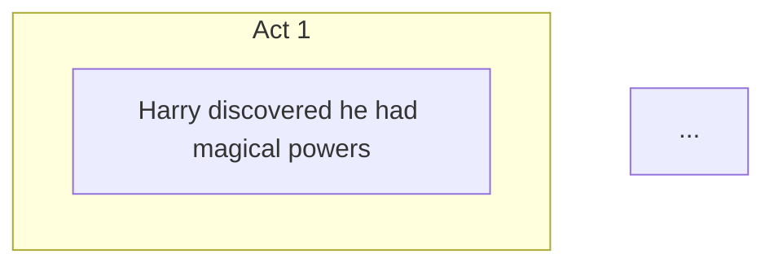

# Visual Story Planner v3 - Quick Start Guide

Get up and running with Visual Story Planner v3 in minutes.

---

## 📋 Prerequisites

Before you begin, ensure you have:

- **Node.js 18+** installed
- **Gemini CLI** installed and configured
- Basic familiarity with command-line tools

---

## 🚀 Installation (5 minutes)

### Step 1: Create Extension Directory

If starting a new project:

```bash
# Create new Gemini extension
gemini extensions new story-planner mcp-server
cd story-planner
```

Or use the existing project directory:

```bash
cd visual-story-extension
```

### Step 2: Install Dependencies

```bash
# Install production dependencies
pnpm install

# Or with npm
npm install
```

### Step 3: Verify Directory Structure

Ensure your project has this structure:

```
visual-story-extension/
├── packages/bl1nk/
│   ├── index.ts
│   ├── src/index.ts
│   ├── types.ts
│   ├── analyzer.ts
│   ├── validators.ts
│   ├── exa-search.ts
│   ├── tools/
│   │   ├── index.ts
│   │   ├── execute.ts
│   │   ├── search-entries.ts
│   │   └── generate-artifacts.ts
│   └── exporters/
│       ├── mermaid.ts
│       ├── canvas.ts
│       ├── dashboard.ts
│       ├── markdown.ts
│       └── json.ts
├── commands/story/
├── skills/
├── dist/
└── [config files]
```

### Step 4: Build the Project

```bash
# Build TypeScript to JavaScript
pnpm run build

# Or with npm
npm run build
```

You should see output like:

```
  dist/server.js               717.7kb
  dist/chunk-*.js              ...
  ⚡ Done in 254ms
```

### Step 5: Link to Gemini CLI

```bash
# Link the extension to Gemini CLI
gemini extensions link .
```

### Step 6: Test Installation

```bash
# Test with a simple story
gemini story analyze "Once upon a time, a brave knight embarked on a quest to save the kingdom."
```

---

## 🎯 Your First Story Analysis

### Quick Analysis (2 minutes)

```bash
gemini story analyze "
Once upon a time, there was a young wizard named Harry.
Harry discovered he had magical powers on his 11th birthday.
He attended Hogwarts School of Witchcraft and Wizardry.
Harry made friends with Ron and Hermione.
Together, they faced the dark wizard Voldemort.
Harry defeated Voldemort and saved the wizarding world.
"
```

**Expected Output:**
- StoryGraph JSON with characters, events, and conflicts
- Validation results
- Recommendations for improvement

### View Validation Results

```bash
gemini story validate
```

**Expected Output:**
- List of structural issues (errors, warnings, info)
- Act distribution analysis
- Recommendations

### Export as Diagram

```bash
gemini story export --format mermaid
```

**Expected Output:**


---

## 🛠️ Common Commands

### Analyze Story
```bash
# Basic analysis
gemini story analyze "Your story text"

# Detailed analysis with metadata
gemini story analyze "Your story" --depth detailed
```

### Export in Different Formats
```bash
# Mermaid diagram
gemini story export --format mermaid

# Canvas JSON (interactive)
gemini story export --format canvas

# HTML Dashboard
gemini story export --format dashboard

# Markdown document
gemini story export --format markdown
```

### Validate Structure
```bash
# Standard validation
gemini story validate

# Strict validation with recommendations
gemini story validate --strict --include-recommendations
```

### Deep Audit
```bash
# Comprehensive audit
gemini story audit --depth deep

# Focus on characters only
gemini story audit --focus-areas characters
```

### Get Refinement Suggestions
```bash
# Refine all elements
gemini story refine

# Focus on characters
gemini story refine --element characters

# Focus on specific character
gemini story refine --element characters --focus-character "Harry"
```

---

## 📊 Understanding Output

### StoryGraph Structure

```json
{
  "meta": {
    "title": "Story Title",
    "genre": "Fantasy",
    "createdAt": "2024-02-19T...",
    "updatedAt": "2024-02-19T...",
    "version": "1.0.0"
  },
  "characters": [
    {
      "id": "c_1",
      "name": "Harry",
      "role": "protagonist",
      "traits": ["brave", "magical"],
      "arc": {
        "start": "Ordinary life",
        "midpoint": "Discovery",
        "end": "Hero",
        "transformation": "Grows from orphan to hero"
      }
    }
  ],
  "events": [
    {
      "id": "e_1",
      "label": "Harry discovers magic",
      "act": 1,
      "importance": "inciting"
    }
  ],
  "conflicts": [...],
  "relationships": [...]
}
```

### Validation Issues

Issues are reported with severity levels:

- **Error**: Must fix (e.g., "Story must have a title")
- **Warning**: Should fix (e.g., "No climax event")
- **Info**: Suggestions (e.g., "Add more characters")

### Act Distribution

Ideal distribution:
- **Act 1**: 25% of events (Setup)
- **Act 2**: 50% of events (Confrontation)
- **Act 3**: 25% of events (Resolution)

---

## 🔧 Configuration

### Environment Variables

Add to your `.env` or shell configuration:

```bash
# Default export mode
export VSP_DEFAULT_MODE=canvas

# Other options: mermaid, dashboard, markdown, json
```

### Settings in gemini-extension.json

Current settings:
- **Default Mode**: Controls default export format

---

## 🐛 Troubleshooting

### Build Fails

**Error**: `Cannot find module '@modelcontextprotocol/sdk'`

**Solution**:
```bash
pnpm install
# or
npm install
```

### Extension Not Found

**Error**: `Extension not linked`

**Solution**:
```bash
gemini extensions link .
```

### Validation Errors

**Error**: "Story must have a title"

**Solution**: Ensure your story text includes a clear title or add one to the metadata.

**Error**: "Missing Act 2 events"

**Solution**: Add more events to the middle of your story (rising action, complications).

**Error**: "No protagonist"

**Solution**: Ensure at least one character has role set to "protagonist".

### Export Fails

**Solution**: Run validation first and fix all errors:
```bash
gemini story validate
# Fix issues, then:
gemini story export --format mermaid
```

---

## 📚 Next Steps

### Learn More

1. **Read the Full Documentation**: See `README.md` for complete reference
2. **Understand Validation Rules**: Check validation section in README
3. **Explore Skills**: Read skill documentation in `skills/` directories
4. **Study Examples**: Look at example outputs in `dist/`

### Best Practices

1. **Always Validate First**: Run `gemini story validate` before exporting
2. **Use Appropriate Depth**: 
   - `basic` for quick checks
   - `detailed` for normal analysis
   - `deep` for comprehensive audit
3. **Follow Three-Act Structure**: 25%-50%-25% distribution
4. **Develop Characters Fully**: Clear arcs, motivations, fears
5. **Escalate Conflicts**: Build tension progressively

### Advanced Usage

- **Custom Commands**: Create your own commands in `commands/`
- **Skill Development**: Extend with custom skills
- **Integration**: Use exports in other tools (Mermaid, web apps, etc.)

---

## 🆘 Getting Help

- **Documentation**: `README.md` - Complete reference
- **System Context**: `GEMINI.md` - AI behavior configuration
- **Skills**: `skills/*/SKILL.md` - Skill-specific documentation
- **Commands**: `commands/story/*.toml` - Command definitions

---

## ✅ Verification Checklist

After installation, verify:

- [ ] `pnpm run build` completes successfully
- [ ] `dist/server.js` exists
- [ ] `gemini extensions link .` succeeds
- [ ] `gemini story analyze "Test"` returns StoryGraph JSON
- [ ] `gemini story validate` returns validation results
- [ ] `gemini story export --format mermaid` returns diagram

---

**Version:** 3.0.0  
**Last Updated:** 2024-02-19  
**Status:** Production Ready
